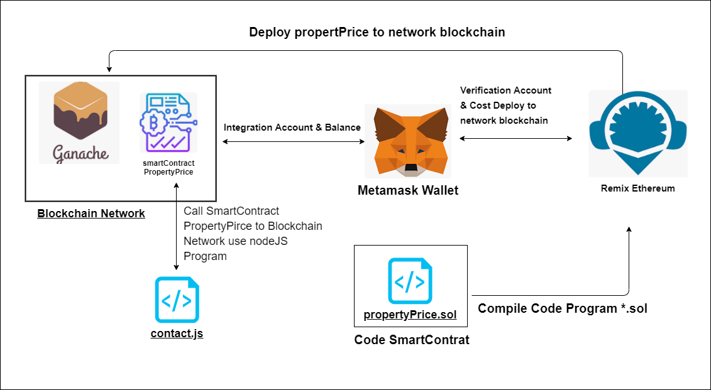
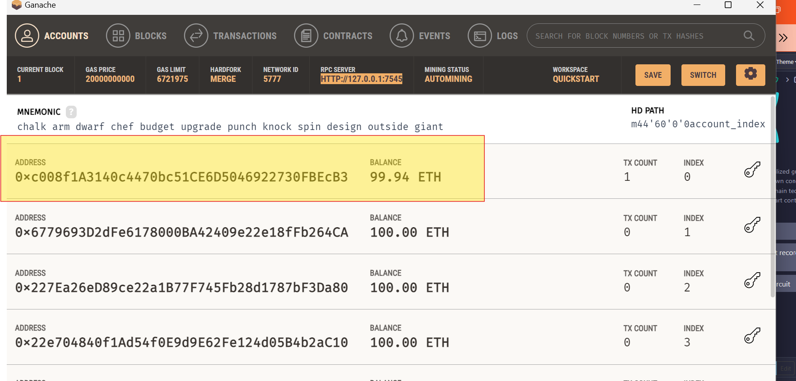
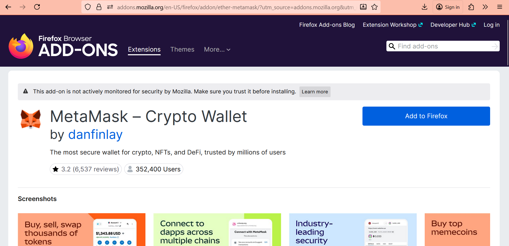
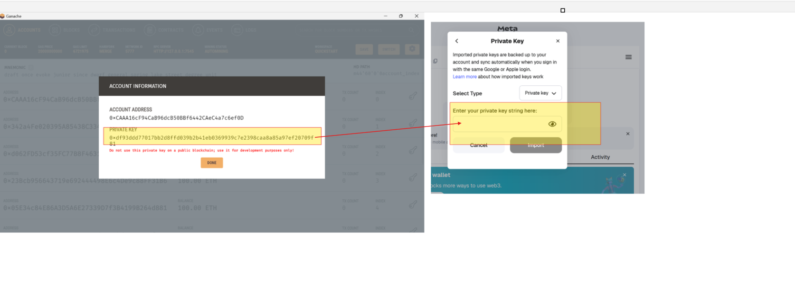
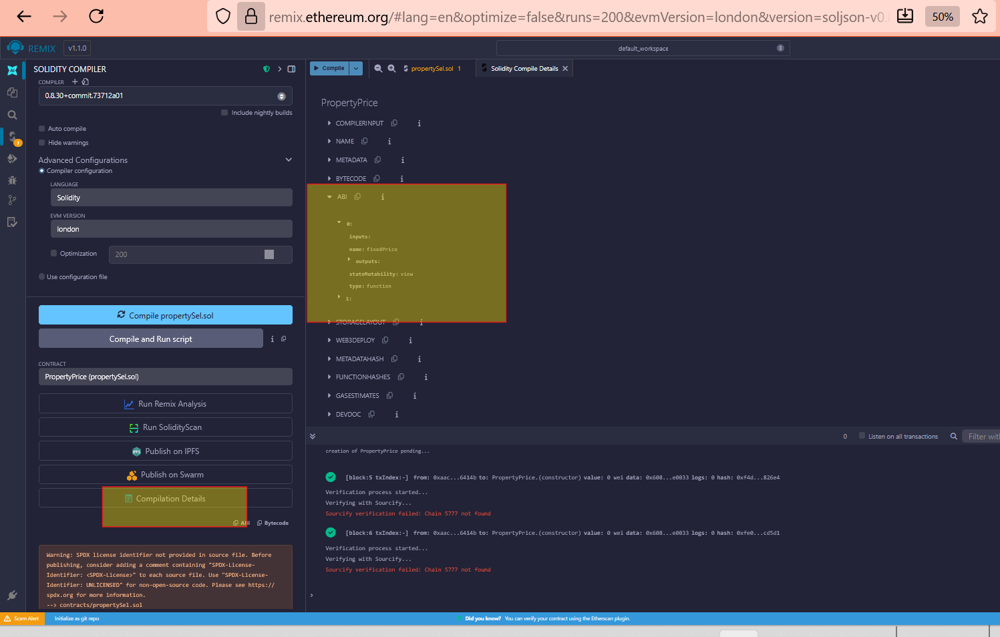
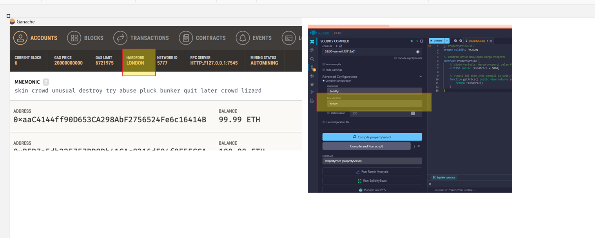
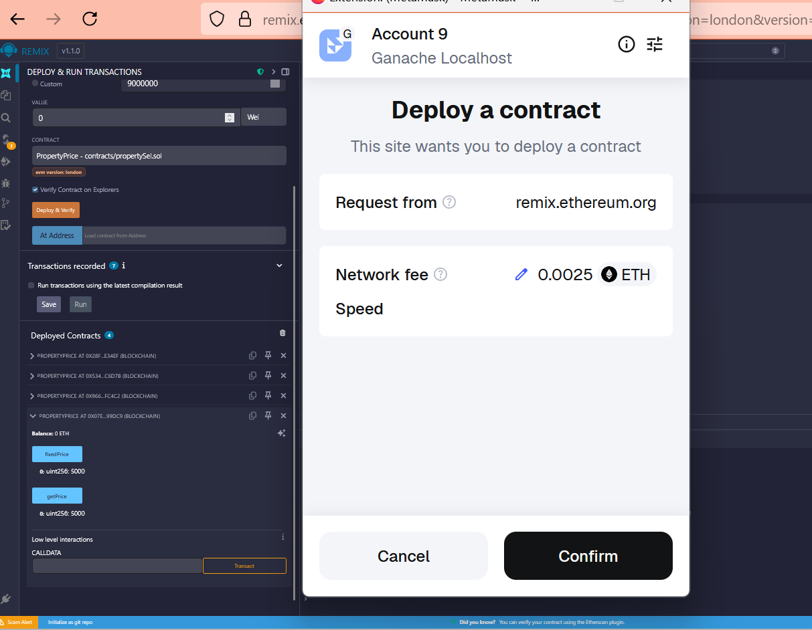
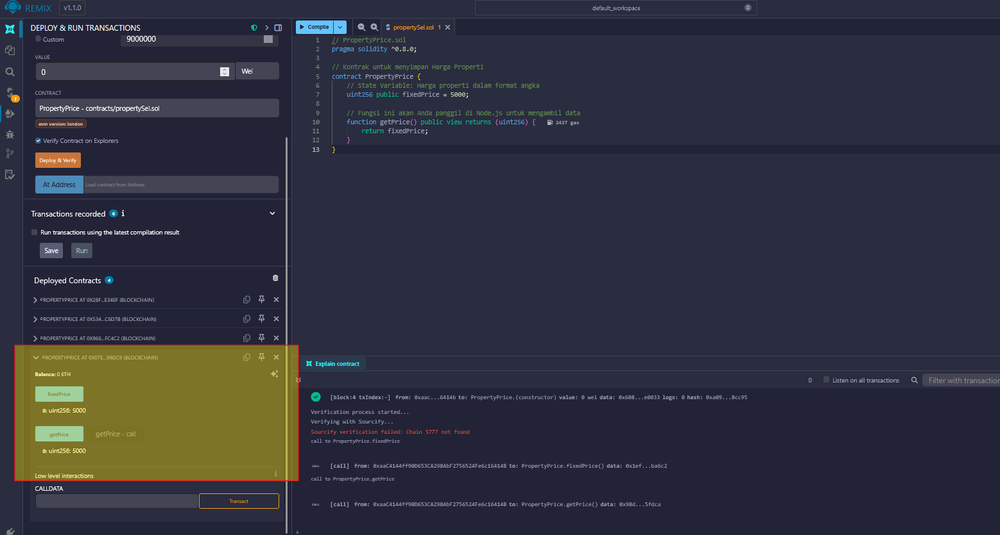
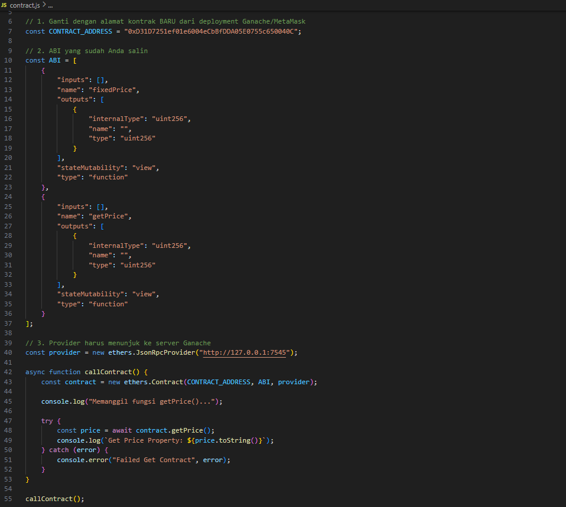
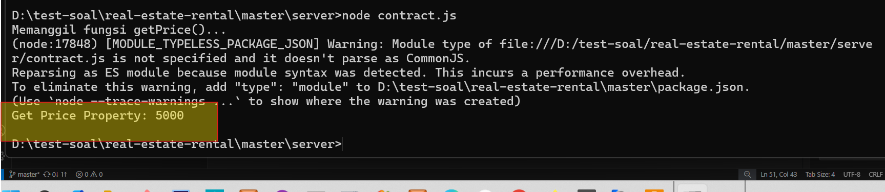

# Smart Contract Implementation In Blockchain

This document explains the development and deployment flow for a simple **Smart Contract** called `propertPrice`. This project uses popular Ethereum ecosystem tools like **Ganache**, **Remix Ethereum**, and **Metamask** to deploy the contract into a local blockchain network.

# Table of Contents

1. Core Concepts
   
   1.1. Blockchain](#11-blockchain-🔗

   1.2. Smart Contract](#12-smart-contract

2. Alur Kerja Implementasi (Deployment Flow)

   2.1. Persiapan Jaringan dan Akun](#21-persiapan-jaringan-dan-akun)

   2.2. Pengembangan dan Kompilasi (Remix)](#22-pengembangan-dan-kompilasi-remix)

   2.3. Deployment (Penyebaran Kontrak)](#23-deployment-penyebaran-kontrak)

   2.4. Interaksi (Memanggil Smart Contract)](#24-interaksi-memanggil-smart-contract)

3. Demo Video

## Github Sourcecode

| Item | Value |
| :--- | :--- |
| **GitHub Repository Blockchain Network Use Ganance** | https://github.com/dendie-sanjaya/blockchain-web3-money |

## 1. Core Concepts

Before diving into the steps, let's briefly understand the two main technologies used: **Blockchain** and **Smart Contract**.

### What is Blockchain? 🔗

**Blockchain** is a distributed and secure database (ledger

* **Simple Definition**: It is a digital record book shared among many computers.
* **Key Features**:
    * **Decentralized**: No single person or company controls the data.
    * **Immutable**: Once a record is saved, it cannot be changed.
    * **Transparent**: Everyone in the network can see the transactions.

This technology creates a **safe** and **trustworthy** record system without needing traditional middlemen.

### What is a Smart Contract? 💡

A **Smart Contract** is a piece of code stored on the blockchain that automatically runs an agreement.

* **Simple Definition**: It is like a digital, self-executing agreement.
* **Key Features**:
    * **Automation**: It runs automatically when pre-set conditions are met (the "if-then" rule).
    * **Trustless**: It removes the need for a third party (like a lawyer or bank) to enforce the agreement.
    * **Permanent**: The contract code cannot be changed once deployed.

Our file, `propertyPrice.sol`, is an example of a Smart Contract.

## 2. Diagram Flow Explanation

The diagram shows the steps to write, compile, and deploy the `propertPrice` Smart Contract.

### 2.1. Blockchain Network 

This blockchain network for localhost / testing can use ganache

### 2.2. Integration Account & Balance 

This section how integration account & balace account in Blockchain Network  to wallet (Metamask)

### 2.3. Compilation Phase

This section how to file *.sol wil compile use remix 

* The developer writes the contract code using **Solidity** language.
* The file contains the logic for managing property data (e.g., setting or getting a price).

* The Solidity code is translated (*compiled*) into a format the blockchain understands (bytecode).
* This is typically done using **Remix Ethereum**, an online tool for development.

### 2.4. Deployment

1.  **Remix Ethereum $\rightarrow$ Metamask Wallet**:
    * **Remix** initiates the deployment process.
    * **Metamask Wallet** acts as the user's account interface. It provides the **Verification Account** and manages the **Cost Deploy** (Gas fees) needed to publish the contract.

2.  **Deploy `propertPrice` to Network Blockchain**:
    * Metamask sends the deployment transaction to the network.

3.  **Blockchain Network (Ganache)**:
    * **Ganache** is the **Local Blockchain Network** used for testing.
    * It provides a private Ethereum environment with pre-funded accounts.
    * Once the deployment transaction is confirmed, the **`PropertyPrice` Smart Contract** is live on the Ganache network.

4.  **Integration Account & Balance**:
    * Ganache confirms the successful deployment, and Metamask updates the account balance after the transaction fee is paid.

### 2.5. Interaction Phase

1.  **`contact.js` Program (node.js Program)**:
    * An external application (a **node.js** program named `contact.js`) is used to talk to the deployed contract.

2.  **Call SmartContract `PropertyPrice` to Blockchain Network**:
    * The **node.js** program calls functions inside the **Smart Contract `PropertyPrice`** (e.g., to record a new price or read existing data).
    * All these interactions are secure and permanently recorded on the **Blockchain Network**.

## 3. Video Demo Smartcontract

This is video smartcontract -> 
